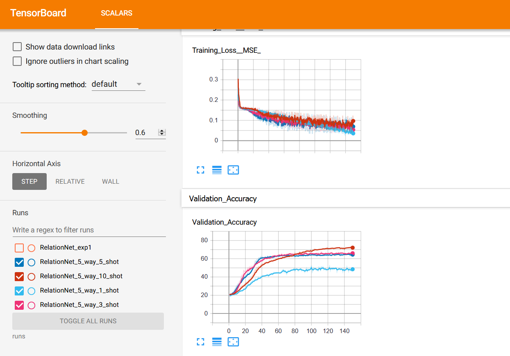

## Relation Network : Learning to compare

This folder contains all the experimentation and analysis related to the [Relation Network](https://arxiv.org/abs/1711.06025).

#### Tasks and Status
|Task|Status|Blog|
|--|--|--|
|Implementation of flower classifier|Done|[Blog](https://maitreyapatel.github.io/few_shot_part_2.html)|
|Experiments with different architectures in above classifier|Done| [Blog](https://maitreyapatel.github.io/few_shot_part_2.html) |
|Experiments on text classification|Ongoing| - |
|Experiments on Speech classification|Remaining| - |

##### Results on flower classification:
Below figure shows the results of RelationNetwork on flower classification with 5 way and 1,3,5,10 shots.

##### Results on news classification
Below table shows the results of different experiments on few shot text classification on news categories. Below experiments evaluates a BERT based embeddings at very initial level.

| Index | Word Embeddings | Embedding Network Specification | Accuracy |
|--|--|--|--|
|(1)|BERT| avg. pool + max pool | ~20% |
|(2)|BERT| avg. pool | ~29% |
|(3)|BERT| BERT + avg. pool + max pool | ~31% |
|(4)|BERT| BiLSTM + 2 linear layers | ~36% |